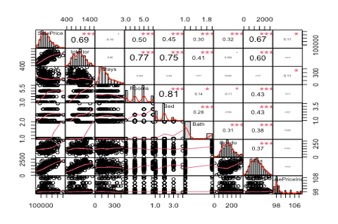
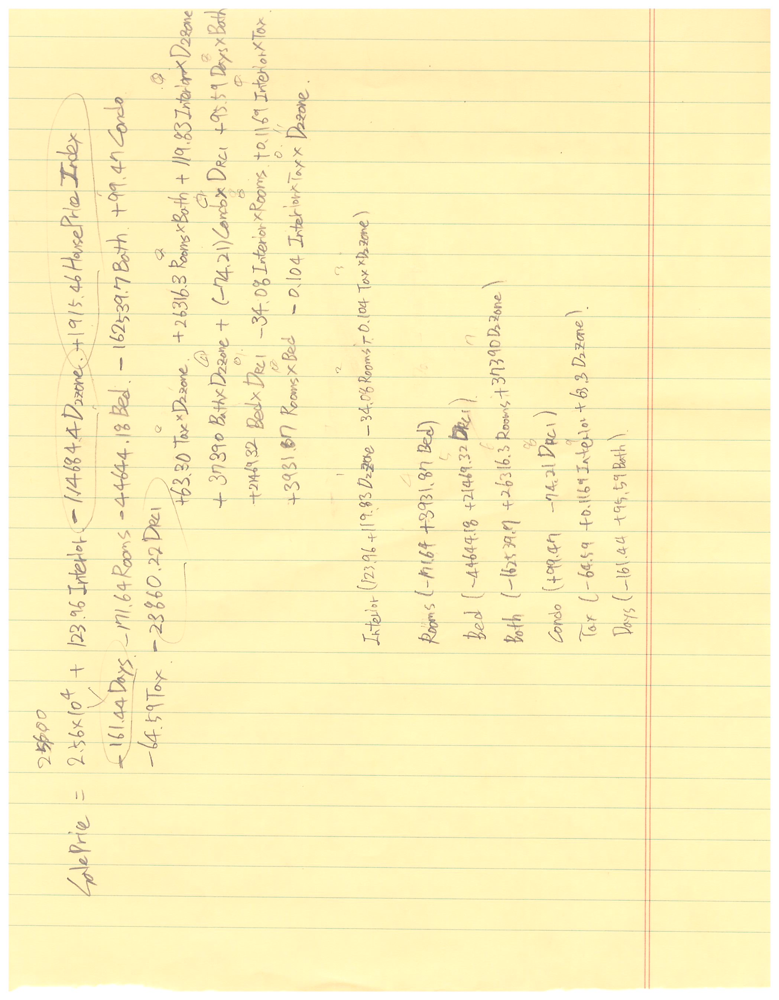

# Reyeme Affiar

## 건물 가격 예측하기

*2023-2 통계자료분석 팀프로젝트*

본 프로젝트 문제는 유출이 금지되어 있다.

때문에 본 프로젝트의 문제에 대해선 간략하게 설명하기로 한다.

## 문제

Reyeme Affiar는 건물을 구매하려 한다. 해당 건물에 대한 방 갯수, 위치, 내부면적 등 다양한 변수값이 주어져 있다.

이와 함께 제공된 데이터는 Reyeme Affiar가 구매를 고려하는 시점에서 몇 년간, 해당 시의 매매 히스토리를 담고 있다.

프로젝트는 데이터와 주어진 변수값을 이용하여 Reyeme Affiar가 구매하려는 건물의 가격(매매가)을 논리적으로 예측하는 것이다.

## 도출해낸 매매가격 예측값과 예측구간

예측값 : 168,540달러

예측구간 : 136,353.8 달러 ~ 200,726.4 달러 (95% 신뢰구간)

## 도출 단계

### 1. 데이터 정리  
#### 1-1. 결측값 정리  
#### 1-2. 변수 선택 및 추가 
- 자료에 주어진 변수 중 매매가를 예측하는데 논리적으로 합당한 변수 선택 및 매매가 예측에 도움이 될만한 변수 추가 *(문제에 주어지지 않은 해당 지역의 House Price Index - FRED 출처 - 추가)*  
#### 1-3. outlier 제거 - 각 변수별 값이 변수별 분포에서 IQR 1.5배 범위를 넘거나, 매매가와 지역간 분산분석 결과의 잔차 분포에서 IQR 1.5배를 범위를 넘는 관측치 제거  

### 2. '매매가' 종속변수, '지역'을 독립변수로 한 분산분석

**지역이 매매가를 예측하는 주요 변수이기 때문에 따로 분산분석 진행**    

#### 2-1. 잔차 등분산성 확인 
#### 2-2. 비모수검정 및 사후검정, 다중비교

- 분산분석 결과를 이용하여, 지역간 매매가 평균 차이가 나지 않는 지역을 묶은 Zone 변수를 생성   

- ex) 마포구, 용산구, 성동구 = Zone1 / 강남구, 서초구, 송파구 = Zone2

### 3. **다중회귀분석**  

매매가를 종속변수로 하고 지역(Zone), 내부면적, House Price Index 등을 독립변수로 하는 다중회귀분석 진행.

#### 3-1. 단계별 선택법 
- 상호작용을 고려한 Full model을 목표로 진행.
    3-2. 다중공선성 확인 및 영향점 제거

- 변수간 상관관계가 높았으나 다중 공선성을 고려하여 변수 제거시 모델의 MSE가 높아지는 현상으로 다중공선성 문제보단 영향점 확인에 집중

- 외적 스튜던트화된 잔차가 1.5 이상인 관측치를 영향점으로 보고 제거

#### 3-3. 영향점 제거 후 다중회귀분석

- 영향점 제거 후 모델의 MSE가 45% 하락하여 해당 모델로 Reyeme Affiar가 구매할 건물 가격 예측 실행.
- 모델이 갖고 있는 각 회귀계수의 타당성에 대한 설명 작성. 
        
- ex) House Price Index의 회귀계수는 1000으로 House Price Index가 클수록, 매매가 클 것이라는 예상에 부합하는 회귀계수이다.

### 4. 회귀 계수 도출

Typing하여 작성시 검색 노출이 우려되어 손글씨 캡쳐본으로 대신함.

캡쳐본의 위 영역은 모든 회귀계수를 나열한 식, 아래 영역은 주요 변수별로 회귀계수를 정리한 것

## End of Document

